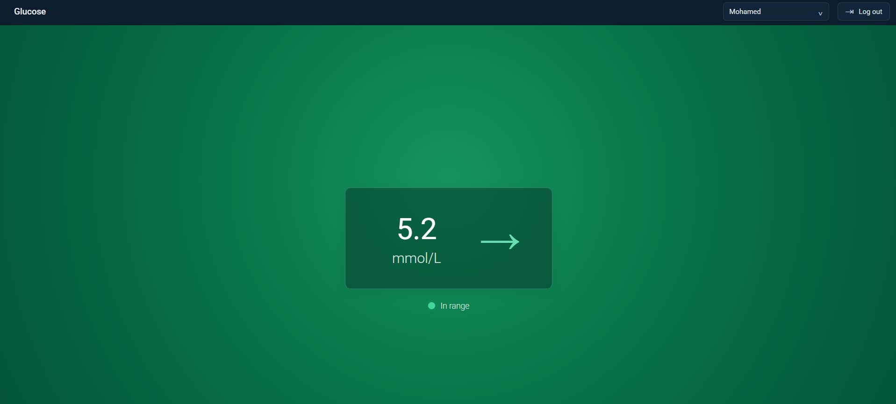

# Libre Desktop
A simple web-based glucose monitoring dashboard using the LibreLinkUp API. Libre Desktop allows users to securely log in, select a patient, and view their current glucose reading and glucose trend arrow from a web browser.
## How It Works
Libre Desktop uses the LibreLinkUp API to retrieve the latest glucose data.

The application follows this general process:
```
Web Browser
     │
     ▼
Libre Desktop
     │
     ▼
Python / FastAPI Backend
     │
     ▼
LibreLinkUp API
     │
     ▼
Glucose Data
     │
     ├── Glucose Level
     └── Trend Direction
```
The backend handles authentication and communication with LibreLinkUp, while the frontend displays the latest glucose information in a simple dashboard.
## Technologies
- Python
- FastAPI
- HTML
- CSS
- JavaScript
- Docker
- LibreLinkUp API
## Running Locally
###   YOU MUST HAVE A LIBRELINKUP ACCOUNT CONNECTED TO USERS FOR IT TO WORK
## Install docker
## 1. Clone the repository
```
git clone https://github.com/mohamedahmed200710/libreDesktop.git
cd libreDesktop
```
## Running with Docker
```
docker build -t libre-desktop .
docker run -d --name libre-desktop -p 100:8000 libre-desktop
```
The application can then be accessed through:
http://localhost:100

## Disclaimer ❗❗❗
Libre Desktop is an independent project and is not affiliated with or endorsed by Abbott or FreeStyle Libre.
This project is intended for educational and personal use. It should not be used as a replacement for medical advice, professional glucose monitoring, or clinical decision-making.
## Demo

